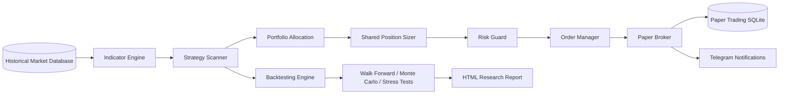

# 📈 Quant Stock

> **A quantitative research framework for the Vietnamese stock market.**

[](#)
[](#license)
[](#research-framework)
[](#development-roadmap)
[](#)

Quant Stock is an **end-to-end quantitative investment research framework** designed specifically for the Vietnamese stock market.

Unlike many retail trading projects that focus solely on finding profitable entry signals, Quant Stock emphasizes **research quality, statistical validation, portfolio simulation, and systematic strategy development**.

The project provides a complete workflow—from historical market data and technical indicators to portfolio-level backtesting, advanced research diagnostics, and persistent paper execution. Validated signals can be passed through shared position sizing, portfolio risk controls, a simulated broker, SQLite state persistence, and Telegram notifications before any live deployment is considered.

---

# 🎯 Project Vision

Quant Stock is **not** designed to find a "holy grail" trading strategy.

Instead, its mission is to answer a much more important question:

> **Can an investment idea survive rigorous quantitative validation?**

Every strategy should demonstrate:

- Positive long-term expectancy
- Statistical robustness
- Stability across different market conditions
- Portfolio-level profitability
- Controlled downside risk

Only after passing multiple validation stages should a strategy be considered for further research.

---

# 💡 Why Quant Stock?

Many open-source trading projects stop after producing a profitable historical backtest.

Unfortunately, a profitable backtest alone says very little.

A strategy may fail because of:

- Overfitting
- Survivorship bias
- Market regime dependency
- Transaction costs
- Poor portfolio construction
- Data snooping

Quant Stock attempts to reduce these risks by integrating multiple validation techniques into a single research framework.

The philosophy is simple:

> **Research first. Trading second.**

---

# 🚀 Key Features

## 📊 Market Data

- Historical SQLite database
- VNINDEX benchmark integration
- Multi-symbol support
- Incremental market updates
- Data freshness validation
- Centralized OHLCV pipeline

---

## 📈 Indicator Engine

Current indicators include:

- EMA (10 / 20 / 50 / 200)
- RSI
- ATR
- ATR Percentage
- ADX
- Relative Strength
- Donchian Channel
- Volume Ratio
- Breakout Detection
- Distance from EMA
- Momentum Indicators

The indicator layer is reusable across scanning, backtesting, research, and execution.

---

## 📌 Entry Models

Implemented strategies:

- Trend Strategy V1
- Donchian Breakout V1
- Hybrid Trend + Donchian
- Market Regime Filter

Strategies follow a common interface so they can be evaluated consistently across the framework.

---

## 📉 Exit Models

Supported exit mechanisms:

- ATR Stop Loss
- ATR Profit Target
- Time-based Exit
- Maximum Holding Period
- Gap-aware Execution
- Trailing ATR logic in research and portfolio simulation

---

## 💼 Portfolio Engine

Portfolio simulation includes:

- Cash management
- Shared position-sizing interface
- ATR risk sizing
- Fixed-fraction sizing for benchmarking
- Transaction costs
- Slippage
- Tax
- Maximum concurrent positions
- Portfolio heat and exposure controls
- Equity curve generation
- Portfolio performance metrics

Unlike many retail backtesting tools, Quant Stock evaluates strategies at the **portfolio level**, providing a more realistic representation of investment performance.

---

## 🧪 Paper Trading Execution

The paper-trading layer extends validated research into a simulated execution environment:

- Shared `PositionSizer` implementations with backtesting
- ATR-based risk sizing by default
- Order Manager
- Risk Guard
- Maximum position and portfolio exposure limits
- Maximum open positions
- Daily loss limit
- Kill switch support
- Commission and slippage simulation
- Persistent orders, fills, positions, and snapshots in SQLite
- Duplicate-position prevention
- Telegram execution summaries
- Paper mode disabled by configuration when not required

No live broker API is called by the paper-trading workflow.

---

## 📲 Notifications

- Daily scanner summaries
- Signal and watchlist reporting
- Paper-order execution results
- Portfolio cash, equity, exposure, and open-position summaries
- Retry handling for temporary Telegram API failures
- Safe message splitting and HTML escaping

---

## 🔬 Research Framework

Current research modules include:

- Walk Forward Validation
- Composite Walk Forward Optimization
- Strategy Ablation Study
- Monte Carlo Simulation
- Parameter Stability Analysis
- Market Regime Analysis
- Trade Quality Diagnostics
- Portfolio Benchmarking
- Portfolio Stress Testing
- Robustness Scoring
- Automated HTML Research Report

These modules help distinguish robust strategies from those that simply fit historical data.

---

# 🏗️ System Architecture



The project now separates research, portfolio construction, execution, persistence, and notification responsibilities.

The same position-sizing abstractions can be reused by portfolio backtests and paper execution, reducing the risk that simulated production behavior diverges from the research configuration.

---

# 🔄 Research and Execution Pipeline

Every investment idea follows a research-first workflow.

```text
Historical Market Data
          │
          ▼
Indicator Calculation
          │
          ▼
Signal Generation
          │
          ▼
Portfolio Backtesting
          │
          ▼
Walk Forward Validation
          │
          ▼
Monte Carlo and Stress Testing
          │
          ▼
Parameter and Model Selection
          │
          ▼
Automated Research Report
          │
          ▼
Shared Position Sizing
          │
          ▼
Risk Guard
          │
          ▼
Paper Broker
          │
          ▼
SQLite Persistence and Telegram
```

The objective is not simply to discover profitable trades, but to understand **why a strategy works, when it works, under which conditions it may fail, and how it behaves in a simulated execution environment**.

Paper trading is a validation stage—not evidence that a strategy is suitable for live capital.

---

# 📂 Repository Structure

```text
quant-stock/
│
├── backtesting/                 # Backtest, portfolio simulation and diagnostics
│   └── position_sizers/         # Shared sizing interfaces and implementations
├── config/                      # Strategy and research configuration
├── core/                        # Database and shared infrastructure
├── data/                        # Local generated databases (ignored by Git)
├── execution/                   # Paper broker, risk guard and order management
├── reporting/                   # Terminal dashboards and reporting helpers
├── research/                    # Walk forward, Monte Carlo, stress and reports
├── scripts/                     # Operational and data-update scripts
├── services/                    # Telegram clients and notification formatters
├── strategy/                    # Indicators, filters, scanners and entry models
├── tests/                       # Automated tests
│
├── .env.example                 # Environment variable template
├── requirements.txt
└── README.md
```

Generated databases, reports, charts, caches, and local `.env` files should remain outside version control.

---

# 📅 Development Journey

The project has evolved through multiple research stages.

| Version | Milestone |
|----------|-----------|
| v0.1 | Historical Data Pipeline |
| v0.2 | Indicator Engine |
| v0.3 | Trend Strategy |
| v0.4 | Donchian Breakout |
| v0.5 | Hybrid Strategy |
| v0.6 | Portfolio Engine |
| v0.7 | Walk Forward Validation |
| v0.8 | Monte Carlo Simulation |
| v0.9 | Market Regime Analysis |
| v1.0 | Documentation Release |
| vNext | Signal Quality Model |

Rather than continuously adding new indicators, development has focused on improving the **quality of research methodology**.

---

# 🎓 Design Principles

Several core principles guide the development of Quant Stock.

### 1. Simplicity

Complex strategies are not necessarily better.

Every rule should have a measurable contribution.

---

### 2. Reproducibility

Every research result should be reproducible from historical market data.

No manual intervention.

No discretionary adjustments.

---

### 3. Robustness

Strategies must survive multiple validation methods before being considered useful.

A single successful backtest is never sufficient evidence.

---

### 4. Risk First

Return is only meaningful when evaluated alongside risk.

Sharpe Ratio, Drawdown, Profit Factor, Expectancy, and Portfolio Stability are treated as first-class metrics.

---

### 5. Research over Prediction

The objective is not to predict tomorrow's market.

The objective is to develop repeatable investment processes supported by quantitative evidence.

---

# ⚙️ Installation

## Prerequisites

Before using Quant Stock, ensure that your environment meets the following requirements.

| Component | Version |
|-----------|---------|
| Python | 3.12+ |
| SQLite | 3.x |
| Git | Latest |
| Operating System | Windows / Linux / macOS |

---

## Clone Repository

```bash
git clone https://github.com/dothanhbo/quant-stock.git

cd quant-stock
```

---

## Create Virtual Environment

Windows

```bash
python -m venv .venv

.venv\Scripts\activate
```

Linux / macOS

```bash
python3 -m venv .venv

source .venv/bin/activate
```

---

## Install Dependencies

```bash
pip install -r requirements.txt
```

---

## Update Market Data

Download the latest market data.

```bash
python scripts/update_market.py
```

---

## Verify Database

The database should contain

- VNINDEX
- Listed stocks
- Historical OHLCV data

Example

```text
market.db

prices

symbols

...
```

---

# 🚀 Quick Start

## 1. Configure environment variables

Create a local `.env` file. Do not commit it.

```env
TELEGRAM_TOKEN=
CHAT_ID=

PAPER_TRADING_ENABLED=false
PAPER_DATABASE_PATH=data/paper_trading.db
PAPER_INITIAL_CASH=100000000

PAPER_POSITION_SIZER=atr_risk
PAPER_RISK_PER_TRADE_PCT=1.0
PAPER_ATR_STOP_MULTIPLIER=2.0
PAPER_MAX_POSITION_PCT=20.0

PAPER_MAX_ORDERS_PER_SCAN=3
PAPER_LOT_SIZE=100
PAPER_MAX_EXPOSURE_PCT=80
PAPER_MAX_OPEN_POSITIONS=10
PAPER_MAX_DAILY_LOSS_PCT=3
PAPER_MIN_CASH_BUFFER_PCT=5
```

Keep `PAPER_TRADING_ENABLED=false` until local tests pass.

## 2. Compile the project

```bash
python -m compileall .
```

## 3. Run the market scanner

```bash
python -m strategy.scanner
```

The scanner evaluates the latest valid market date, prints the signal dashboard, persists new signals, and sends the Telegram summary.

## 4. Run a single-symbol backtest

```bash
python -m backtesting.engine --symbol HPG --quiet
```

## 5. Run composite walk-forward validation

```bash
python -m research.composite_walk_forward --symbols HPG FPT --start 2018-01-01 --end 2024-12-31 --train-years 4 --test-months 12 --step-months 12
```

## 6. Run portfolio stress testing

```bash
python -m research.benchmark_portfolio_stress --symbols HPG FPT
```

## 7. Generate the research dashboard

```bash
python -m research.generate_research_report
```

Open the generated HTML file from `research_results/`.

## 8. Test shared position sizing

```bash
python test_shared_position_sizer.py
```

## 9. Enable paper trading

After the tests pass, update:

```env
PAPER_TRADING_ENABLED=true
```

Then run:

```bash
python -m strategy.scanner
```

Paper execution will use the configured shared position sizer, pass orders through `RiskGuard`, persist account state in SQLite, and send a separate Telegram portfolio update.

---

# 📊 Market Data

Quant Stock is designed around a centralized historical database.

Current data includes

- Open
- High
- Low
- Close
- Volume

Benchmark

- VNINDEX

The database serves as the single source of truth for every research module.

This ensures that

- every strategy uses identical data
- research is reproducible
- historical experiments remain consistent

---

# 🧮 Indicator Engine

The Indicator Engine transforms raw market data into reusable quantitative features.

Current implementation includes

| Indicator | Purpose |
|-----------|----------|
| EMA10 | Short trend |
| EMA20 | Intermediate trend |
| EMA50 | Medium trend |
| EMA200 | Long-term trend |
| RSI | Momentum |
| ATR | Volatility |
| ATR % | Relative volatility |
| ADX | Trend strength |
| Relative Strength | Stock vs VNINDEX |
| Volume Ratio | Volume expansion |
| Donchian High | Breakout detection |
| Distance EMA20 | Extension measurement |
| Return 3D | Overheating filter |

Indicators are calculated only once and reused throughout the research pipeline.

This design greatly reduces duplicated computation.

---

# 🎯 Strategy Framework

Every strategy inherits from a common base interface.

```text
BaseStrategy

↓

Trend Strategy

↓

Donchian Strategy

↓

Hybrid Strategy
```

This modular architecture allows new strategies to be added without modifying the backtesting engine.

---

## Trend Strategy

Designed to capture sustained market trends.

Core concepts

- EMA alignment
- Trend confirmation
- ADX filter
- Volume confirmation
- Relative Strength

Suitable for

- trending markets
- medium-term swing trading

---

## Donchian Breakout

Designed to detect momentum breakouts.

Core concepts

- 20-day breakout
- volume expansion
- trend confirmation
- breakout validation
- ATR risk management

Suitable for

- momentum trading
- breakout continuation

---

## Hybrid Strategy

Combines

- Trend Following

and

- Donchian Breakout

Current modes

- Strict
- Trend Context
- Score Blend

Research shows that different hybrid modes perform differently under changing market conditions.

---

# 🌍 Market Regime

One of the key features of Quant Stock is the ability to classify the market environment before evaluating trading opportunities.

Current regimes

- BULL
- SIDEWAY
- BEAR

The classification currently uses

- EMA50
- EMA200
- EMA50 slope
- 20-day return

instead of relying on simple moving-average crossovers.

This approach helps reduce false regime changes during noisy periods.

Market regime is used by

- Hybrid Strategy
- Signal Evaluation
- Research Diagnostics
- Trade Quality Analysis

Future versions may include

- Volatility Regime
- Breadth Indicators
- Macro Filters

---

# 💰 Portfolio Engine

Unlike traditional single-stock backtests, Quant Stock evaluates strategies using a portfolio simulation engine.

Current features

- Cash management
- Position sizing
- Maximum concurrent positions
- Transaction costs
- Buy commission
- Sell commission
- Sell tax
- Buy slippage
- Sell slippage
- Equity curve
- Portfolio statistics

The engine supports realistic execution assumptions instead of idealized fills.

---

## Transaction Cost Model

Each trade includes

- Buy commission
- Sell commission
- Transaction tax
- Slippage

These costs are included automatically in

- Net PnL
- Portfolio Return
- Equity Curve
- Drawdown
- Sharpe Ratio

This makes research results significantly closer to real-world performance.

---

## Portfolio Statistics

The engine currently reports

- Total Return
- CAGR
- Maximum Drawdown
- Sharpe Ratio
- Sortino Ratio
- Profit Factor
- Win Rate
- Expectancy
- Transaction Cost
- Final Equity

Future versions will also include

- Calmar Ratio
- Ulcer Index
- Rolling Sharpe
- Rolling Drawdown

---

# 🔧 Extending the Framework

Adding a new strategy requires only two steps.

### Step 1

Create a new class

```python
class MyStrategy(BaseStrategy):
    ...
```

### Step 2

Implement

```python
evaluate(...)
```

The strategy automatically becomes compatible with

- Backtesting
- Portfolio Engine
- Walk Forward
- Monte Carlo
- Trade Diagnostics
- Market Regime
- Research Reports

No changes are required elsewhere in the framework.

---

# 📈 Design Philosophy

Quant Stock follows a modular research-first architecture.

Every module has one responsibility.

```text
Market Data

↓

Indicators

↓

Strategies

↓

Portfolio

↓

Research

↓

Reports
```

This separation makes the framework

- easy to maintain
- easy to test
- easy to extend

while reducing coupling between components.

---

# 🔬 Research Framework

A profitable historical backtest alone is not sufficient evidence that a strategy possesses a genuine trading edge.

Quant Stock therefore applies multiple layers of validation to every strategy before drawing conclusions.

The objective is to determine whether a strategy is

- statistically robust,
- stable across different market environments,
- resilient to parameter changes,
- and capable of surviving realistic portfolio simulation.

Current research modules include

- Walk Forward Validation
- Monte Carlo Simulation
- Parameter Stability Analysis
- Market Regime Analysis
- Portfolio Backtesting
- Trade Quality Diagnostics
- Strategy Ablation Study

Together, these modules form the core research workflow of Quant Stock.

---

# 🔄 Walk Forward Validation

One of the biggest dangers in quantitative investing is **overfitting**.

A strategy that performs well on historical data may simply be memorizing the past rather than capturing a persistent market behavior.

To reduce this risk, Quant Stock uses **Walk Forward Validation**.

The process is illustrated below.

```text
Training Window

↓

Optimize Strategy

↓

Freeze Parameters

↓

Out-of-Sample Test

↓

Slide Forward

↓

Repeat
```

Unlike a traditional backtest, Walk Forward repeatedly evaluates a strategy on **previously unseen data**.

This provides a much stronger indication of whether the observed performance is likely to generalize.

Current implementation supports

- multiple rolling windows
- fixed training periods
- out-of-sample evaluation
- portfolio-level validation

---

# 🎲 Monte Carlo Simulation

Historical trades represent only one possible sequence of outcomes.

Real markets may produce trades in a completely different order.

To estimate the range of possible future performance, Quant Stock applies **Monte Carlo Simulation**.

Two simulation methods are currently implemented.

---

## Shuffle Simulation

Trade results are randomly reordered while preserving the original trade distribution.

Purpose

- evaluate sequence risk
- estimate drawdown variability
- assess return stability

---

## Bootstrap Simulation

Trades are randomly sampled **with replacement**.

Purpose

- estimate confidence intervals
- simulate unseen market paths
- evaluate robustness under uncertainty

---

Current outputs include

- Probability of Profit
- Probability of Loss
- Probability of CAGR > 5%
- Probability of CAGR > 10%
- Drawdown Distribution
- Sharpe Distribution
- Profit Factor Distribution
- Final Equity Distribution

Rather than focusing on a single historical outcome, Monte Carlo evaluates thousands of plausible futures.

---

# ⚙️ Parameter Stability Analysis

Many trading systems perform well only under one specific parameter combination.

Such systems are often fragile and fail after deployment.

Quant Stock evaluates parameter robustness by testing multiple combinations across

- ATR Stop
- ATR Target
- Maximum Holding Period

Each configuration is compared using

- CAGR
- Sharpe Ratio
- Drawdown
- Profit Factor
- Expectancy

The goal is **not** to identify the single best parameter set.

Instead, the objective is to identify **stable regions** where performance remains consistently acceptable.

Strategies with broad stability are preferred over those requiring highly specific parameter values.

---

# 🌍 Market Regime Analysis

Market behavior changes over time.

A strategy that performs well during strong bull markets may fail during sideways or bearish environments.

Quant Stock therefore classifies every trading day into one of three regimes.

- BULL
- SIDEWAY
- BEAR

Current classification uses

- EMA50
- EMA200
- EMA50 slope
- 20-day index return

Every completed trade is linked to the corresponding market regime.

This allows research questions such as

- Does the strategy perform better in bull markets?
- How does expectancy change during bear markets?
- Should position sizing depend on market regime?

Market regime statistics include

- win rate
- average return
- expectancy
- holding period
- payoff ratio
- profit factor

---

# 📈 Portfolio Research

Single-stock backtests can produce misleading conclusions.

Capital allocation constraints, overlapping positions, and cash management significantly influence real investment performance.

Quant Stock therefore evaluates strategies using a portfolio simulation engine.

Current portfolio features include

- maximum concurrent positions
- capital allocation
- realistic transaction costs
- slippage
- taxation
- cash management
- equity tracking

Portfolio-level evaluation provides a much more realistic estimate of long-term investment performance.

---

# 🧪 Trade Quality Diagnostics

Every completed trade contains additional diagnostic information beyond simple profit and loss.

Examples include

- Signal Score
- Relative Strength
- ADX
- Volume Ratio
- Market Regime
- Entry Model
- Holding Period

These attributes allow trades to be grouped and analyzed after the backtest.

Typical research questions include

- Do higher Signal Scores produce better returns?
- Does stronger Relative Strength improve expectancy?
- Which ADX range performs best?
- Does high volume improve breakout quality?
- Which entry model produces the highest quality trades?

Trade diagnostics transform a backtest into a structured research dataset.

---

# 🧩 Strategy Ablation Study

A strategy often contains multiple rules.

Not every rule contributes equally.

Quant Stock supports ablation studies by removing or modifying individual components and measuring the resulting impact.

Examples include

- removing ADX filter
- removing Relative Strength
- disabling Volume confirmation
- disabling Market Regime
- replacing Trend Entry
- replacing Exit Model

The objective is to identify

- essential rules
- redundant filters
- unnecessary complexity

This helps keep strategies both simple and effective.

---

# 📊 Performance Metrics

Every experiment reports a common set of evaluation metrics.

Performance

- Total Return
- CAGR
- Final Equity

Risk

- Maximum Drawdown
- Volatility

Risk-adjusted Performance

- Sharpe Ratio
- Sortino Ratio
- Calmar Ratio (planned)

Trade Statistics

- Win Rate
- Profit Factor
- Payoff Ratio
- Expectancy
- Average Holding Period

Portfolio Statistics

- Maximum Open Positions
- Cash Utilization
- Transaction Cost
- Equity Curve

---

# 📚 Research Findings

The following observations have been obtained from the current research process.

### Finding 1

Portfolio-level evaluation provides substantially different conclusions from isolated single-stock backtests.

---

### Finding 2

Strategies that appear profitable in historical backtests may fail Walk Forward Validation.

---

### Finding 3

Parameter stability is often more valuable than maximizing historical return.

---

### Finding 4

Market regime significantly influences both expectancy and drawdown.

---

### Finding 5

Monte Carlo Simulation provides a more realistic estimate of future uncertainty than a single historical equity curve.

---

### Finding 6

Transaction costs have a measurable impact on long-term portfolio performance and should always be included during research.

---

### Finding 7

Hybrid strategies generally exhibit more stable behavior across different market environments than purely trend-following approaches.

---

# 🏆 Current Research and Execution Status

| Module | Status |
|---------|--------|
| Market Data Pipeline | ✅ |
| Indicator Engine | ✅ |
| Trend Strategy | ✅ |
| Donchian Breakout | ✅ |
| Hybrid Strategy | ✅ |
| Signal Scoring and Watchlist | ✅ |
| Market Regime Adaptation | ✅ |
| Portfolio Engine | ✅ |
| Shared Position Sizing | ✅ |
| Walk Forward Validation | ✅ |
| Composite Walk Forward | ✅ |
| Monte Carlo Simulation | ✅ |
| Parameter Stability | ✅ |
| Portfolio Stress Testing | ✅ |
| Robustness Scoring | ✅ |
| Automated HTML Research Report | ✅ |
| Telegram Scanner Notification | ✅ |
| Paper Broker | ✅ |
| Risk Guard | ✅ |
| SQLite Paper Persistence | ✅ |
| Paper Execution Telegram Summary | ✅ |
| Order Exit Lifecycle | 🚧 |
| Paper Performance Analytics | 📅 Planned |
| Live Broker Integration | 📅 Planned |
| Machine Learning Ranking | 📅 Planned |

---

# 📈 Current Performance Snapshot

One of the strongest configurations discovered so far achieved

| Metric | Value |
|---------|------:|
| Total Return | +70.40% |
| CAGR | 7.24% |
| Sharpe Ratio | 1.58 |
| Profit Factor | 1.41 |
| Max Drawdown | -13.94% |

These results were obtained using portfolio-level backtesting with realistic transaction costs.

Historical performance is presented for research purposes only and should not be interpreted as a guarantee of future returns.

---

# 🛣️ Development Roadmap

Quant Stock follows an iterative, research-driven development process. New execution capabilities are added only after their corresponding research and risk assumptions are testable.

## ✅ Phase 1 — Research Foundation

Completed:

- Historical market database and update pipeline
- Indicator engine
- Trend, Donchian, and hybrid entry models
- Exit models and transaction-cost assumptions
- Portfolio-level backtesting
- Walk Forward Validation
- Monte Carlo simulation
- Parameter stability and diagnostics
- Market regime analysis

## ✅ Phase 2 — Portfolio Research and Robustness

Completed:

- Shared `PositionSizer` interface
- Fixed-fraction and ATR risk sizing
- Portfolio allocation diagnostics
- Composite weighting research
- Portfolio stress scenarios
- Robustness ranking
- Automated HTML research dashboard

## ✅ Phase 3 — Paper Execution Foundation

Completed:

- Telegram client refactor
- Notification formatter separation
- Paper Broker
- Order Manager
- Risk Guard
- Commission and slippage simulation
- SQLite persistence
- Shared sizing between backtesting and paper trading
- Paper execution Telegram summaries
- Duplicate-position prevention
- Portfolio cash, equity, and exposure reporting

## 🚧 Phase 4 — Order Lifecycle and Paper Analytics

Current focus:

- Mark-to-market updates
- Stop-loss and take-profit execution
- Trailing stop handling
- Exit-signal processing
- Order and position reconciliation
- Daily portfolio snapshots
- Realized and unrealized performance analytics
- Paper equity curve
- Win rate, profit factor, expectancy, and drawdown reporting
- Daily and weekly Telegram summaries

## 📅 Phase 5 — Controlled Live-Execution Preparation

Planned only after paper validation:

- Broker adapter interface
- Live order reconciliation
- Partial-fill handling
- Idempotent retries
- Trading-session validation
- Heartbeat and connection monitoring
- Audit logging
- Emergency kill switch
- Deployment and operational monitoring

## 📅 Phase 6 — Signal Intelligence Research

Potential future work:

- Probability-calibrated signal ranking
- Feature engineering
- Machine-learning-assisted prioritization
- Explainable model diagnostics
- Sector and correlation-aware allocation

Live execution is intentionally not treated as a shortcut. It remains downstream of research validation, paper execution, lifecycle management, and operational risk controls.

---

# 🔮 Future Research

The framework is intentionally designed to remain open for future extensions.

Possible research topics include

### Portfolio Construction

- Risk Parity
- Minimum Variance
- Hierarchical Risk Parity
- Equal Risk Contribution

---

### Signal Engineering

- Relative Strength Ranking
- Breadth Indicators
- Sector Rotation
- Momentum Ranking
- Volatility Filters

---

### Risk Management

- Dynamic Stop Loss
- ATR Position Sizing
- Regime-dependent Risk
- Tail Risk Analysis

---

### Machine Learning

Potential models

- Logistic Regression
- Random Forest
- XGBoost
- LightGBM
- CatBoost

Potential applications

- Trade Ranking
- Signal Filtering
- Win Probability
- Return Prediction

---

### Alternative Data

Possible future integrations

- Macroeconomic indicators
- Interest rates
- Foreign investor flows
- ETF flows
- Financial statements
- Earnings surprises

---

# 📖 Lessons Learned

Throughout the development of Quant Stock, several important lessons emerged.

### 1.

A profitable backtest alone provides little evidence of a genuine edge.

---

### 2.

Portfolio-level evaluation produces very different conclusions from isolated stock testing.

---

### 3.

Walk Forward Validation exposes overfitting much more effectively than historical optimization.

---

### 4.

Parameter robustness is generally more valuable than selecting the single best parameter combination.

---

### 5.

Transaction costs should always be included during research.

Ignoring realistic execution assumptions significantly overestimates long-term performance.

---

### 6.

Market Regime explains a considerable portion of strategy performance variation.

---

### 7.

Simple strategies often generalize better than highly optimized rule sets.

---

# 🤝 Contributing

Contributions are welcome.

Potential contribution areas include

- New indicators
- New strategies
- Portfolio optimization
- Research modules
- Documentation improvements
- Bug fixes
- Performance optimization

Before opening a Pull Request, please ensure

- Code follows project style
- Tests pass successfully
- Documentation is updated
- New functionality includes appropriate comments

---

# 🧪 Testing Philosophy

Every new feature should satisfy three conditions.

1.

It produces reproducible results.

2.

It does not break existing research modules.

3.

It can be validated using historical market data.

---

# 📚 References

The following resources inspired parts of this project.

Books

- Advances in Financial Machine Learning
- Trading Systems and Methods
- Quantitative Trading
- Algorithmic Trading

Research Topics

- Walk Forward Optimization
- Monte Carlo Analysis
- Risk Management
- Portfolio Theory
- Trend Following
- Momentum Investing

---

# 📄 License

This project is released under the MIT License.

You are free to

- use
- modify
- distribute
- extend

provided the original license is retained.

---

# ⚠️ Disclaimer

This repository is intended solely for

- educational purposes
- quantitative research
- strategy development

Nothing contained in this repository constitutes financial advice, investment advice, or a recommendation to buy or sell any financial instrument.

Past performance does not guarantee future results.

Users remain solely responsible for all investment decisions.

---

# 👨‍💻 Author

Developed by **Do Thanh Bo**

MBA Student | Quantitative Research Enthusiast | Vietnamese Stock Market

GitHub

https://github.com/dothanhbo

---

# ⭐ Acknowledgements

This project would not exist without

- the open-source Python ecosystem,
- the Vietnamese quantitative investing community,
- and the many researchers who have shared their work on systematic trading.

Special thanks to everyone who contributes to open financial research.

---

# 📈 Project Status

Current Version

```text
v1.1 — Research Framework with Paper Execution Foundation
```

Status

```text
Active Development
```

Primary Focus

```text
Order Lifecycle and Paper Trading Analytics
```

Current Stage

```text
Phase 4
```

---

# 🎯 Final Thoughts

Quant Stock was never intended to become another trading bot.

Its primary objective is to become a **quantitative research and controlled execution framework** capable of testing ideas objectively, validating assumptions statistically, and carrying validated signals into a persistent paper-trading environment before any live-capital decision.

Every module—from data collection and indicator calculation to portfolio simulation and research diagnostics—has been developed with a single philosophy:

> **Research first. Evidence second. Execution last.**

The framework will continue evolving toward a more robust, transparent, and reproducible environment, with near-term work focused on position lifecycle management, paper-performance analytics, reconciliation, and operational safety before live-broker integration is considered.

If this repository helps your own research or learning journey, consider giving it a ⭐ and sharing your ideas through discussions or pull requests.

Happy Research!
